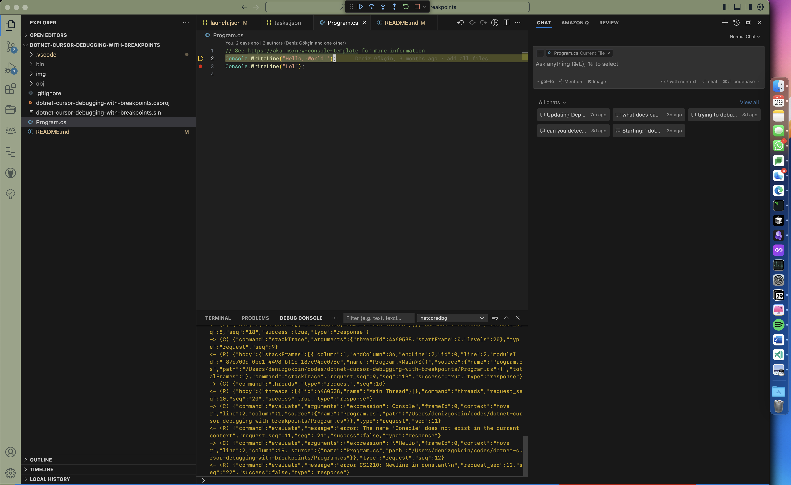

# dotnet-cursor-debugging-with-breakpoints
> [!NOTE]
> This repository is now archived as Cursor has released their in-house extensions that support .NET debugging out of the box. You can find more information about the new extensions in the [Cursor forum post](https://forum.cursor.com/t/new-in-house-extensions-c-c-ssh-devcontainers-wsl-python/94531). This repository is kept for historical purposes and for users who might still need to use netcoredbg for specific use cases.




This repository demonstrates how to debug a .NET application using breakpoints in Cursor, specifically for environments where installing the [free-vscode-csharp](https://github.com/muhammadsammy/free-vscode-csharp) .vsix extension or using a pre-compiled release of [netcoredbg](https://github.com/Samsung/netcoredbg) from GitHub does not work out of the box.

While trying to get this to work, I have encountered with various problems like debugger not stopping at breakpoints, debugging session starting and stopping unexpectedly, and various error messages, so I decided to document the process for anyone else who might encounter the same issues.

The trick for me was to build netcoredbg from source and use the locally built version of netcoredbg in the debugger path in Cursor.

> [!IMPORTANT]
> Visual Studio Code officially supports .NET debugging only with its proprietary `vsdbg` tool, which is limited to Visual Studio Code, Visual Studio Code Insiders, and Visual Studio products. This solution explores an alternative approach using Samsung's open-source `netcoredbg` tool.

> [!NOTE]
> This method has been successfully tested on an M2 Mac running macOS Sonoma. Users on other platforms may have different experiences.

The following instructions will guide you through setting up and using `netcoredbg` for .NET debugging in Cursor, offering a workaround for platforms where the standard debugging tools or extensions may not function as expected.

## Setup Instructions

1. Clone the [netcoredbg](https://github.com/Samsung/netcoredbg) repository:

   ```bash
   git clone https://github.com/Samsung/netcoredbg.git
   ```

2. Install the [prerequisites](https://github.com/Samsung/netcoredbg?tab=readme-ov-file#prerequisites) as listed in the netcoredbg repository.

3. [Compile netcoredbg](https://github.com/Samsung/netcoredbg?tab=readme-ov-file#building) for your architecture, setting the install prefix to `$HOME/.local` for avoiding potential permission issues:

   ```console
   mkdir build
   cd build
   CC=clang CXX=clang++ cmake -DCMAKE_INSTALL_PREFIX=$HOME/.local ..
   ```

4. Install netcoredbg with make:

   ```console
   make install
   ```

5. Replace the `debuggerPath` in your `launch.json` file with the path to your freshly compiled netcoredbg executable, if you have used a different install prefix.

6. Download and install the [C# extension](https://marketplace.visualstudio.com/items?itemName=ms-dotnettools.csharp) for Cursor.

7. Set a breakpoint at the first line in `Program.cs` and hopefully you'll be able to stop at the breakpoint when you start debugging. 🤞

8. If you can not stop at breakpoints, see the Troubleshooting section below.

## Troubleshooting

If the steps above do not work for you like they did not for me, there may be architecture issues with the netcoredbg build. Make sure that the cmake, clang, and clang++ in your system are compatible with the arm64 architecture. You can check this by executing the following commands:

```bash
file $(which clang++)
file $(which clang)
file $(which cmake)
```

For example, on an ARM64 system, you should see output similar to:

```console
/usr/bin/clang++: Mach-O universal binary with 2 architectures: [x86_64:Mach-O 64-bit executable x86_64] [arm64e:Mach-O 64-bit executable arm64e]
/usr/bin/clang++ (for architecture x86_64):     Mach-O 64-bit executable x86_64
/usr/bin/clang++ (for architecture arm64e):     Mach-O 64-bit executable arm64e

/usr/bin/clang: Mach-O universal binary with 2 architectures: [x86_64:Mach-O 64-bit executable x86_64] [arm64e:Mach-O 64-bit executable arm64e]
/usr/bin/clang (for architecture x86_64):       Mach-O 64-bit executable x86_64
/usr/bin/clang (for architecture arm64e):       Mach-O 64-bit executable arm64e

/opt/homebrew/bin/cmake: Mach-O 64-bit executable arm64
```

If arm64 is not seen in the output, you may need to upgrade your LLVM installation. On macOS with Homebrew, you can use the following command:

```bash
arch -arm64 brew upgrade llvm
```

After ensuring your tools are compatible with arm64, retry the compilation process for netcoredbg as described in the setup instructions.

If you encounter issues with the standard compilation process, particularly on M1, M2, or M3 Macs, try the following:

1. Check the cmake output for architecture detection:

   ```console
   user@build$ CC=clang CXX=clang++ cmake -DCMAKE_INSTALL_PREFIX=$HOME/.local ..

   CMake Deprecation Warning at CMakeLists.txt:1 (cmake_minimum_required):
   Compatibility with CMake < 3.5 will be removed from a future version of
   CMake.

   Update the VERSION argument <min> value or use a ...<max> suffix to tell
   CMake that the project does not need compatibility with older versions.


   -- The C compiler identification is AppleClang 15.0.0.15000309
   -- The CXX compiler identification is AppleClang 15.0.0.15000309
   -- Detecting C compiler ABI info
   -- Detecting C compiler ABI info - done
   -- Check for working C compiler: /Library/Developer/CommandLineTools/usr/bin/clang - skipped
   -- Detecting C compile features
   -- Detecting C compile features - done
   -- Detecting CXX compiler ABI info
   -- Detecting CXX compiler ABI info - done
   -- Check for working CXX compiler: /Library/Developer/CommandLineTools/usr/bin/clang++ - skipped
   -- Detecting CXX compile features
   -- Detecting CXX compile features - done
   Detected OSX x86_64
   ...
   ```

2. If the architecture is not correctly detected (e.g., shows as x86_64 on an ARM64 machine), use the following command with additional flags to force the correct architecture:

> [!NOTE]
> The following commands include extra flags that were crucial for making my configuration work on my M2 Mac, especially when the system wasn't being correctly detected as ARM64 at the start of the cmake command(possibly due to lingering x86_64 components from an Intel backup):
> - `-DCMAKE_SYSTEM_PROCESSOR=arm64`: Specifies the target system processor as ARM64.
> - `-DCMAKE_OSX_ARCHITECTURES=arm64`: Sets the target architecture for macOS builds.
> - `-DCMAKE_APPLE_SILICON_PROCESSOR=arm64`: Ensures ARM64 is used for Apple Silicon.
> - `-DCMAKE_INSTALL_PREFIX=$HOME/.local`: Sets the installation prefix to avoid potential permission issues.
>
> Without these flags, the system may not be correctly detected as ARM64, which can lead to compilation issues.

   ```console
   user@netcoredbg$ mkdir build
   user@netcoredbg$ cd build
   user@build$ CC=clang CXX=clang++ cmake \
   -DCMAKE_SYSTEM_PROCESSOR=arm64 \
   -DCMAKE_OSX_ARCHITECTURES=arm64 \
   -DCMAKE_INSTALL_PREFIX=$HOME/.local \
   -DCMAKE_APPLE_SILICON_PROCESSOR=arm64 \
   ..
   ```

3. After successful compilation, proceed with the `make install` command and continue with the setup instructions.

## References

- https://github.com/Samsung/netcoredbg/issues/98#issuecomment-1167349916
- https://github.com/Samsung/netcoredbg/issues/102?tab=readme-ov-file
